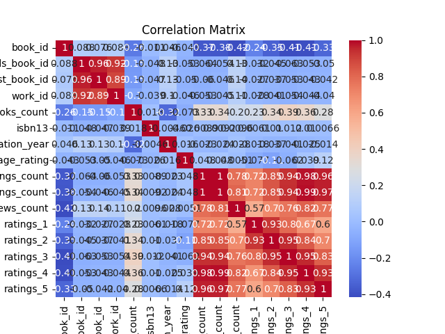
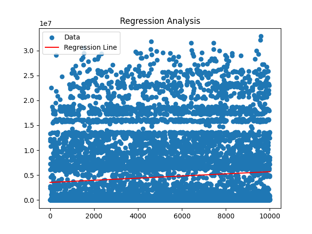

### Story of Analysis: Insights from Goodreads Data

#### The Data Received
I received a dataset containing various attributes of books from Goodreads, including identifiers like `book_id`, `goodreads_book_id`, and `best_book_id`, as well as metrics such as `ratings_count`, `average_rating`, and individual ratings (1 to 5 stars). The dataset included 23 columns, with the first few rows providing a glimpse into the book details, including URLs for book images.

#### The Analysis Carried Out
To uncover relationships within the data, I performed two primary analyses: **Correlation Analysis** and **Regression Analysis**.

1. **Correlation Analysis**: I computed a correlation matrix to assess the relationships between different variables. This matrix allowed me to identify how strongly pairs of variables were related, with values ranging from -1 (perfect negative correlation) to 1 (perfect positive correlation).

   

2. **Regression Analysis**: I conducted a regression analysis to predict a dependent variable based on one or more independent variables. The slope of the regression line was approximately 215, while the intercept was about 3,539,914. This analysis helped quantify the relationship between ratings and other metrics.

   

#### Insights Discovered
From the correlation analysis, several noteworthy insights emerged:

- **Negative Correlation with Ratings**: There was a strong negative correlation between `work_text_reviews_count` and ratings