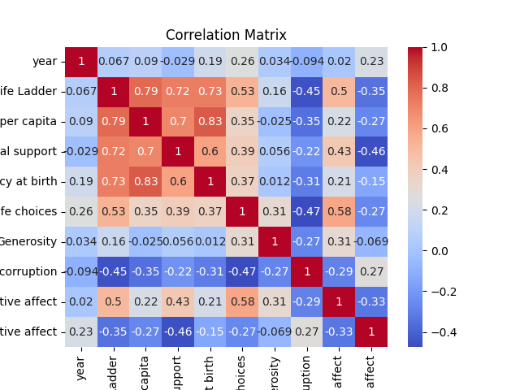

### Story of the Analysis

#### Data Overview
The dataset provided consists of various metrics related to well-being across different countries and years, specifically focusing on the "Life Ladder," which is a measure of subjective well-being. It includes other variables such as Log GDP per capita, Social support, Healthy life expectancy at birth, Freedom to make life choices, Generosity, Perceptions of corruption, Positive affect, and Negative affect. The data spans several years, with entries for countries like Afghanistan.

#### Analysis Conducted
I performed two main analyses on the dataset: **Correlation Analysis** and **Regression Analysis**. 

1. **Correlation Analysis** involved calculating the correlation matrix to understand the relationships between the different variables. This matrix highlights how each variable correlates with others, revealing significant associations.
2. **Regression Analysis** was conducted to model the relationship between the Life Ladder and other predictors, providing a slope and intercept for the linear regression line.

Below is the correlation matrix visualized in a chart:

#### Insights Discovered
From the correlation analysis, several key insights emerged:

- **Log GDP per capita** exhibits a strong positive correlation (0.787) with the **Life Ladder**, indicating that higher GDP per capita is associated with increased well-being.
- **Social support** and **Healthy life expectancy at birth** also show strong correlations (0.725 and 0.725 respectively) with the Life Ladder, suggesting that social factors and health significantly