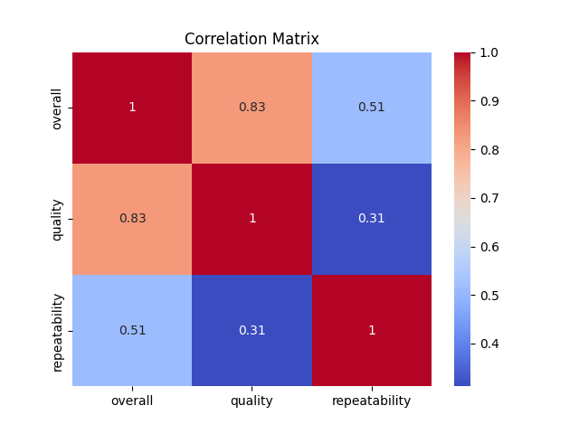
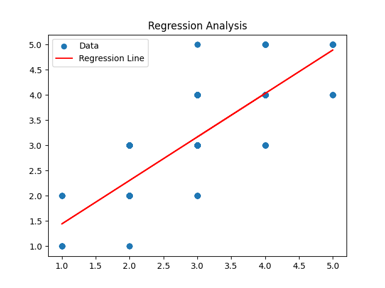

### Analysis Story

#### Data Overview
The dataset provided consists of movie ratings from various users, categorized by attributes such as date, language, type, title, contributors, and three key numerical ratings: overall, quality, and repeatability. The first five entries illustrate a variety of Tamil and Telugu movies, showcasing a range of ratings from 2 to 5.

#### Analysis Conducted
To understand the relationships between the ratings, I performed two main analyses: a correlation analysis and a regression analysis.

1. **Correlation Analysis**:
   I computed the correlation matrix, which revealed the strength and direction of relationships between the different rating metrics.

   

   The correlation coefficients indicate:
   - A strong positive correlation (0.826) between overall ratings and quality.
   - A moderate positive correlation (0.513) between overall ratings and repeatability.
   - A weaker correlation (0.312) between quality and repeatability.

2. **Regression Analysis**:
   I fitted a linear regression model to predict overall ratings based on quality ratings. The regression equation derived from the analysis is:
   \[
   \text{Overall Rating} = 0.8634 \times \text{Quality} + 0.5781
   \]

   

#### Insights Discovered
The analysis highlighted that quality ratings are a strong predictor of overall ratings. This suggests that improving the perceived quality of a